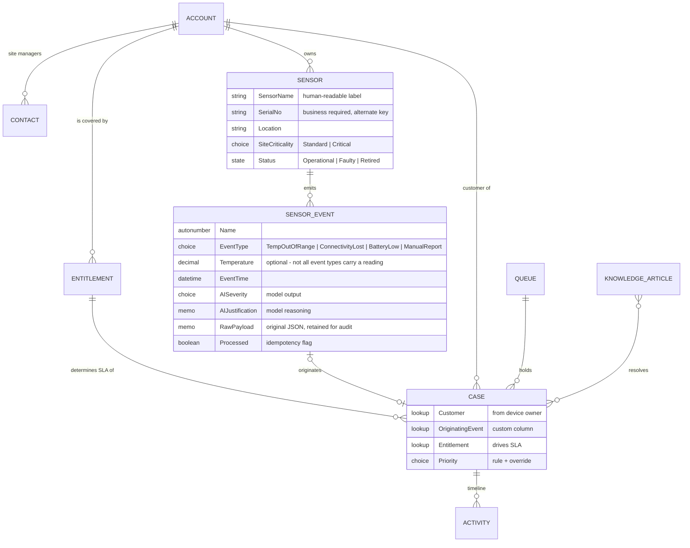
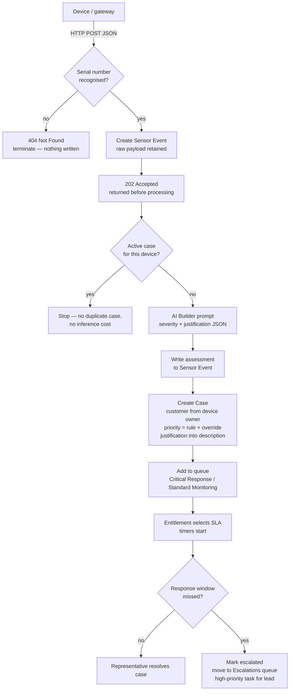
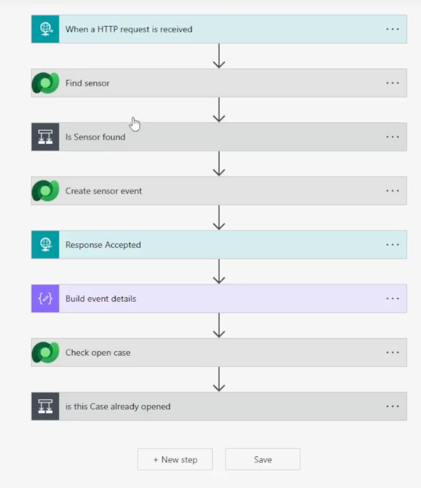
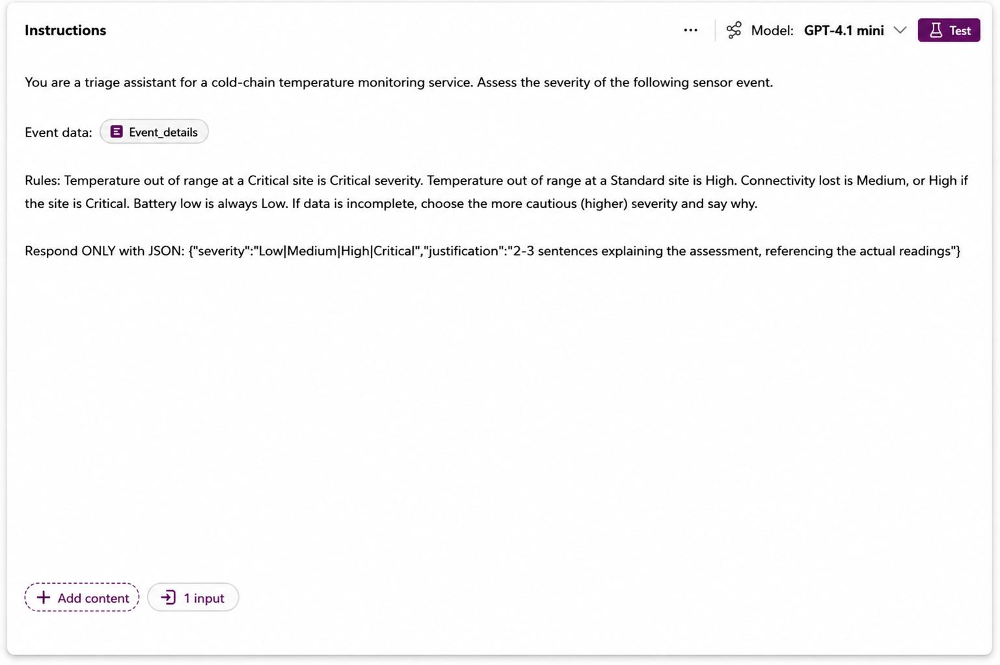
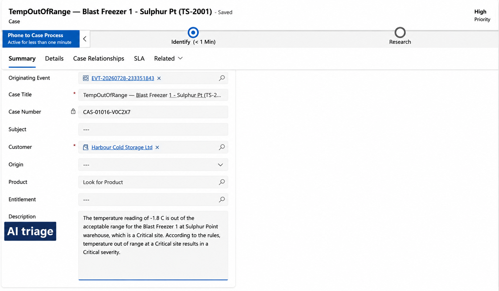
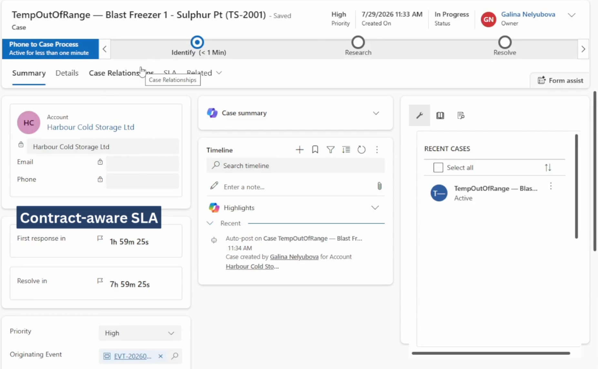
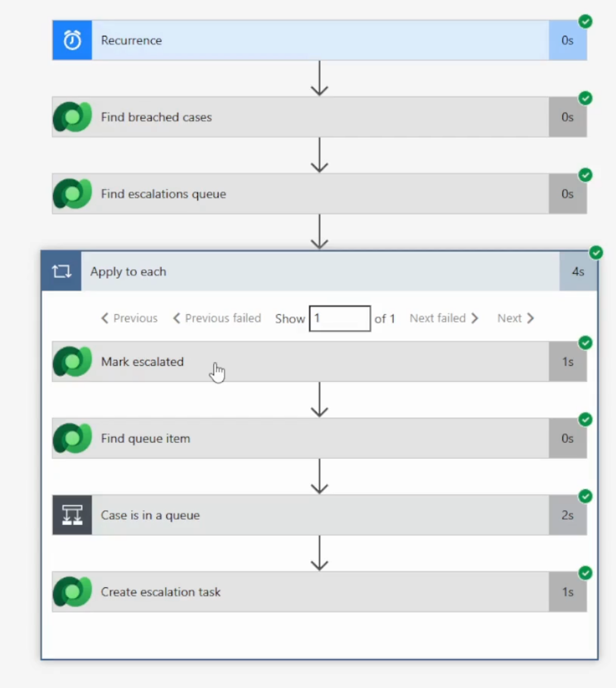

# Cold-Chain Sensor Support
### Dynamics 365 Customer Service — reference implementation

An IoT temperature sensor reports an excursion. The system validates the device, has an AI model assess severity and record its reasoning, creates the service case for the correct customer, sets priority by business rule, routes it to the appropriate queue, applies the SLA defined by that customer's contract, and escalates if the response window is missed. No manual intervention until a representative opens an already-triaged incident.

Author: Galina Nelyubova — Auckland, New Zealand citizen. PL-200, AI-900.

| | |
|---|---|
| Demo video (1.5 min) | [link](https://youtu.be/rFNqokF-G6o) |
| Design decisions and fit-gap analysis | [docs/01_Design_Decision_Register.md](docs/01_Design_Decision_Register.md) |
| Test log | [docs/02_Test_Log.md](docs/02_Test_Log.md) |
| Security matrix | [docs/03_Security_Matrix.md](docs/03_Security_Matrix.md) |
| ALM and data migration notes | [docs/04_ALM_Notes.md](docs/04_ALM_Notes.md) |
| Solution export (unmanaged) | [solution/](solution/) |

---

**Technologies:** Dynamics 365 Customer Service · Microsoft Dataverse · Power Automate · Power Apps (model-driven) · AI Builder · Power Platform solutions · OData · REST/webhook integration · PowerShell.

**Practices:** requirements analysis · fit-gap analysis · solution design and configuration · design decision records · data modelling · process automation · integration design · AI governance and cost control · security design · data migration · ALM and environment management · test design and defect analysis · licensing and cost estimation.

---

## 1. Business context

A New Zealand vendor sells IoT temperature sensors for cold-chain assets and services them under monitoring contracts. Its customers purchase two outcomes: demonstrable temperature continuity for MPI/HACCP audits, and avoidance of spoilage loss, where a single excursion in a loaded cold store represents tens of thousands of dollars of stock and a subsequent insurance dispute.

Both outcomes fail in the same way: the vendor learns of the incident late, handles it inconsistently, misses the response time its own contract commits to, and cannot reconstruct events afterwards. The requirement is therefore not case management in general, but detection ahead of the customer, response within the commitment that customer purchased, and a retained evidence trail.

## 2. Solution overview

| Capability | Implementation |
|---|---|
| Automated intake | HTTP-triggered flow; device validated by serial number against the register; unrecognised senders rejected |
| AI triage | AI Builder prompt returns structured severity and a written justification, stored on the event and surfaced in the case |
| Deterministic prioritisation | Priority derived from event type, AI severity and site criticality, with a fixed override: a temperature excursion is never below High |
| Contract-aware service levels | Entitlements carry the contract tier; SLA timers differ per customer for the same incident type |
| Duplicate suppression | An active case for the same device suppresses further case creation and prevents redundant inference cost |
| Escalation | Scheduled flow marks overdue cases, moves them to the escalation queue and raises a task for the team lead |
| Supporting configuration | Three queues, two SLAs with KPIs, entitlements, knowledge base, business process flow, model-driven admin app, two security roles |

## 3. Data model

Two custom tables sit alongside the standard Customer Service model, so that platform mechanics — entitlements, SLA, routing, timeline — operate as designed rather than being re-implemented.



Custom tables are limited to `Sensor` and `Sensor Event`. Account, Contact, Case, Entitlement, Queue and Knowledge Article are standard tables used as they are.

## 4. Process flow



### 4.1 Intake

HTTP trigger with a defined JSON schema. The device is resolved by serial number using an alternate key; unknown serials receive `404` and no records are written. The event is stored with its raw payload for audit, and the caller receives `202 Accepted` before any processing that costs time or credits.



### 4.2 AI assessment

The prompt receives device, site, site criticality, event type and reading, and returns structured JSON containing a severity value and a two-to-three sentence justification referencing the actual measurements. Cost is approximately 0.2 Copilot credits per assessment.



### 4.3 Case creation and routing

The customer is inherited from the device owner. Priority is calculated in the flow and constrained by the business override. The AI justification is written to the case description so the representative sees the rationale immediately. The case is linked to its originating event and placed in the queue matching its severity.



### 4.4 Service levels

The customer's active entitlement determines which SLA applies. A premium contract produces a short first-response window that tightens further for High priority; a standard contract produces a longer one; a customer without a contract receives the baseline SLA rather than the premium terms.



### 4.5 Escalation

A scheduled flow selects active cases with no first response beyond the response window, marks them escalated, moves the queue item to the escalation queue and creates a high-priority task for the team lead. Each step is recorded on the case timeline.



## 5. Components

| Layer | Detail |
|---|---|
| Dynamics 365 Customer Service | Cases, queues, SLAs and SLA KPIs, entitlements, knowledge base, business process flow, timeline activities |
| Dataverse | Two custom tables; alternate keys; referential relationships with restrict-delete; choice sets; autonumber; native state and status model |
| Power Automate | Four flows: HTTP intake, scheduled escalation, two idempotent data seeders using OData filters, natural-key deduplication and a dry-run pattern |
| AI Builder | Prompt with constrained JSON output (GPT-4.1 mini), invoked from the intake flow and versioned as a solution component |
| Applications | Model-driven application for the device register and administration |
| Security | Two roles separating transactional work from master data |
| ALM | Segmented solution with a custom publisher; unmanaged export retained after each build stage |

## 6. Principal design decisions

| Decision | Rationale |
|---|---|
| Custom Sensor table rather than Field Service Customer Assets | Field Service licensing and functional surface are not justified by a monitoring-only scope |
| AI for judgement, flow for guarantees | Commitments the business must honour are enforced deterministically; the model assesses and explains |
| Inference placed after duplicate detection | A repeatedly firing device would otherwise consume inference capacity with no business value |
| Conversational analytics agent rejected | Aggregation over records is where language models fabricate figures; such questions belong in views and Power BI |
| Configuration data restored from documentation | Solutions carry schema, not records; queues, SLAs and entitlements require Configuration Migration Tooling in a real deployment |

The complete register contains 40 decisions with alternatives considered, trade-offs and status: [docs/01_Design_Decision_Register.md](docs/01_Design_Decision_Register.md).

## 7. Limitations of this implementation

- Telemetry is simulated by HTTP POST; no physical device or IoT gateway is involved.
- SLA and escalation thresholds are shortened for demonstration, and escalation is measured from case creation rather than from the contract KPI.
- Security roles are configured but not verified with a second licensed user, as trial licensing did not permit one.
- The out-of-the-box routing rule set was configured and activated but did not generate queue items in this trial environment; queue assignment is performed in the intake flow, which is the intended design for an automated channel, and manual queue assignment was verified for the human path.
- No email channel: the trial environment has no Exchange mailbox.

## 8. Planned second stage

Power Pages portal for site managers; Copilot Studio triage agent correlating multiple events from a single site into one incident; claim-evidence agent assembling temperature history, case timeline and SLA compliance with mandatory human review; real-time workflow for synchronous validation; renewal opportunity generation; battery-level prediction; Power BI reporting; four-role security model.

## 9. Repository structure

```
README.md
docs/01_Design_Decision_Register.md    decisions, alternatives, trade-offs, status
docs/02_Test_Log.md                    scenarios, expected and actual results
docs/03_Security_Matrix.md             role, table and privilege matrix
docs/04_ALM_Notes.md                   solution segmentation and data migration approach
docs/System_Logic.md                   flow-by-flow specification
docs/images/                           screenshots
solution/                              unmanaged solution export
```

---

Fictional customer scenario; all data is synthetic. Implemented in a Dynamics 365 Customer Service trial environment on a Power Platform developer tenant.
